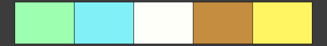
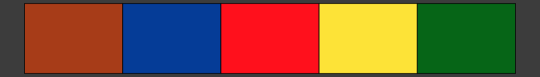
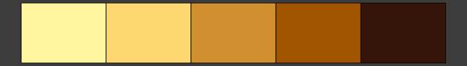

<!-- README.md is generated from README.Rmd. Please edit that file -->

# gameR 

<!-- badges: start -->

[](https://github.com/nathansam/gameR/actions)
[](https://app.codecov.io/gh/nathansam/gameR)
[](https://cran.r-project.org/package=gameR)

[](https://opensource.org/licenses/GPL-3.0)
<!-- badges: end -->

gameR provides a collection of R colour palettes inspired by video
games. Note: these colour palettes may not be colour blind friendly.

## Installation

gameR is on CRAN! Install the stable version of gameR with:

``` r
install.packages("gameR")
```

You can install the development version of gameR from
[GitHub](https://github.com/) with:

``` r
# install.packages("devtools")
remotes::install_github("nathansam/gameR")
```

## Getting started

``` r
library(gameR)
library(ggplot2)
```

At present, paintR only supports discrete colour palettes. These
palettes are provided via the `paintR_cols()` function with the name of
the palette passed as an argument. For a full list of the palettes
provided by `gameR`, call `gameR_cols()` without any arguments.

``` r
gameR_cols()
#> [1] "cups"      "cyberpunk" "fallout"   "gris"      "rayman"    "spirit"   
#> [7] "splat"     "superbros" "wow"
```

## Contributing Palettes

Contributions via pull requests are welcome! I would love to have as
many video games represented as possible. With that said, there are two
requirements I ask of any contributed palettes:

1.  The palette must be at least somewhat distinctive. There are many
    popular and beloved games, but if the palette suggestion does not
    evoke the video game that inspired it, it probably should not be
    contributed.
2.  Please avoid trademarked names for palette names. I am not entirely
    sure how far the [CRAN
    policy](https://cran.r-project.org/web/packages/policies.html)
    extends when it comes to trademarked names but I would rather not
    risk running afoul of CRAN policy.

### Adding the Palette to the List

Adding a new palette is as simple adding a new element to the
`gameR_colors` list in
[R/discrete.R](https://github.com/nathansam/gameR/blob/main/R/discrete.R),
adding the name of the palette to `@param palette`, and calling
`devtools::document()` from R to update the package documentation.

### Updating the README

The readme is generated by
[README.Rmd](https://github.com/nathansam/gameR/blob/main/README.Rmd).
Please update this file with the palettes you are contributing (the
palettes are in alphabetical order) and knit the file before committing
and pushing your contributions.

### Credit

If you are contributing palette(s), I would love for your contribution
to be recognised. Please feel free to add yourself as a contributor
(role = “ctb”) in the
[DESCRIPTION](https://github.com/nathansam/gameR/blob/main/DESCRIPTION)
file.

### Palettes

This section presents a list of the palettes provided by gameR listed in
alphabetical order of the name of the game which inspired the palette.

### Cuphead

``` r
gameR_cols("cups")
```



### Cyberpunk

``` r
gameR_cols("cyberpunk")
```



### Fallout

``` r
gameR_cols("fallout")
```


### Gris

``` r
gameR_cols("gris")
```


### Rayman

``` r
gameR_cols("rayman")
```


### Spiritfarer

``` r
gameR_cols("spirit")
```



### Splatoon

``` r
gameR_cols("splat")
```


### Super Mario Bros

``` r
gameR_cols("superbros")
```


### World of Warcraft

``` r
gameR_cols("wow")
```


