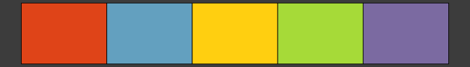
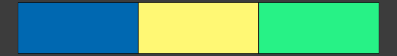
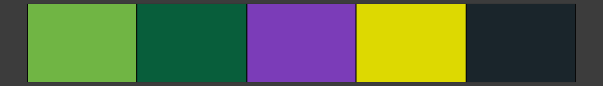
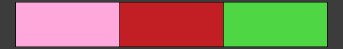
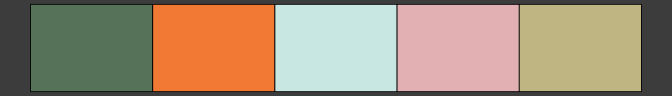

<!-- README.md is generated from README.Rmd. Please edit that file -->

# gameR 

<!-- badges: start -->

| Usage                                                                                                                            | Release                                                                                                      | Development                                                                                                                                                                                            |
|----------------------------------------------------------------------------------------------------------------------------------|--------------------------------------------------------------------------------------------------------------|--------------------------------------------------------------------------------------------------------------------------------------------------------------------------------------------------------|
| [](https://opensource.org/license/gpl-3-0/)                | [](https://cran.r-project.org/package=gameR) | [](https://github.com/nathansam/gameR/actions)                                                                                |
|                                     | [](https://nathansam.r-universe.dev)     | [](https://app.codecov.io/gh/nathansam/gameR)                                                            |
| [](https://r-pkg.org/pkg/gameR) |                                                                                                              | [](https://www.repostatus.org/#active) |
|                                                                                                                                  |                                                                                                              | [](https://style.tidyverse.org)                                                            |

<!-- badges: end -->

gameR provides a collection of R color palettes inspired by video games.

**Note**: these color palettes may *not* be color blind friendly. If
accessibility is a priority, I recommend either using the [virdis
package](https://CRAN.R-project.org/package=viridis) or checking your
plots before sharing using tools which simulate color blindness such as
[coblis](https://www.color-blindness.com/coblis-color-blindness-simulator/)

**Table of Contents**

- [Installation](#installation)
- [Getting started](#getting-started)
- [Palettes](#palettes)
- [Contributing new palettes](#contributing-new-palettes)

## Installation

gameR is on CRAN! Install the stable version of gameR with:

``` r
install.packages("gameR")
```

You can install the development version of gameR, which may contain
additional palettes, from [r-universe](https://r-universe.dev/search/)
with:

``` r
# Enable universe(s) by nathansam
options(repos = c(
  nathansam = "https://nathansam.r-universe.dev",
  CRAN = "https://cloud.r-project.org"
))

install.packages("gameR")
```

## Getting started

``` r
library(gameR)
library(ggplot2)
```

gameR provides either discrete color palettes or continuous palettes
generated by interpolating a discrete palette. Discrete palettes and
continuous palettes are provided via the `gameR_cols()` and
`gameR_cont()` functions respectively with the name of the palette
passed as an argument. For a full list of the palettes provided by
`gameR`, call one of these functions without any arguments.

``` r
gameR_cols()
#>  [1] "blocks"    "border"    "cowboy"    "cups"      "cyberpunk" "fallout"  
#>  [7] "gris"      "ocarina"   "p4g"       "pman"      "rayman"    "sonic"    
#> [13] "spirit"    "splat"     "superbros" "wow"
```

## Palettes

This section presents a list of the palettes provided by gameR ordered
alphabetically by the name of the game which inspired the palette.

### Borderlands

``` r
gameR_cols("border")
```


### Cuphead

``` r
gameR_cols("cups")
```


### Cyberpunk

``` r
gameR_cols("cyberpunk")
```


### Fallout

``` r
gameR_cols("fallout")
```



### Gris

``` r
gameR_cols("gris")
```


### Legend of Zelda: Ocarina of Time

``` r
gameR_cols("ocarina")
```


### Pac-Man

``` r
gameR_cols("pman")
```



### Persona 4 Golden

``` r
gameR_cols("p4g")
```


### Rayman

``` r
gameR_cols("rayman")
```



### Red Dead Redemption II

``` r
gameR_cols("cowboy")
```



### Sonic the Hedgehog

``` r
gameR_cols("sonic")
```


### Spiritfarer

``` r
gameR_cols("spirit")
```



### Splatoon

``` r
gameR_cols("splat")
```


### Super Mario Bros

``` r
gameR_cols("superbros")
```


### Tetris

``` r
gameR_cols("blocks")
```


### World of Warcraft

``` r
gameR_cols("wow")
```


## Contributing new palettes

Contributions via pull requests are welcome! I would love to have as
many video games represented as possible. With that said, there are two
requirements I ask of any contributed palettes:

1.  The palette must be at least somewhat distinctive. There are many
    popular and beloved games, but if the palette suggestion does not
    evoke the video game that inspired it, it probably should not be
    contributed.
2.  Please avoid trademarked names for palette names. I am not entirely
    sure how far the [CRAN
    policy](https://cran.r-project.org/web/packages/policies.html)
    extends when it comes to trademarked names but I would rather not
    risk running afoul of CRAN policy.

### Adding a New Palette to the gameR Palette List

Adding a new palette is as simple adding a new element to the
`gameR_colors` list in
[R/palettes.R](https://github.com/nathansam/gameR/blob/main/R/palettes.R),
and calling `devtools::document()` from R to update the package
documentation.

### Updating the README

The README is generated by
[README.Rmd](https://github.com/nathansam/gameR/blob/main/README.Rmd).
Please update this file with the palettes you are contributing (the
palettes are in alphabetical order) and knit the file before committing
and pushing your contributions.

### Credit

If you are contributing palette(s), I would love for your contribution
to be recognized. Please feel free to add yourself as a contributor
(role = “ctb”) in the
[DESCRIPTION](https://github.com/nathansam/gameR/blob/main/DESCRIPTION)
file.
