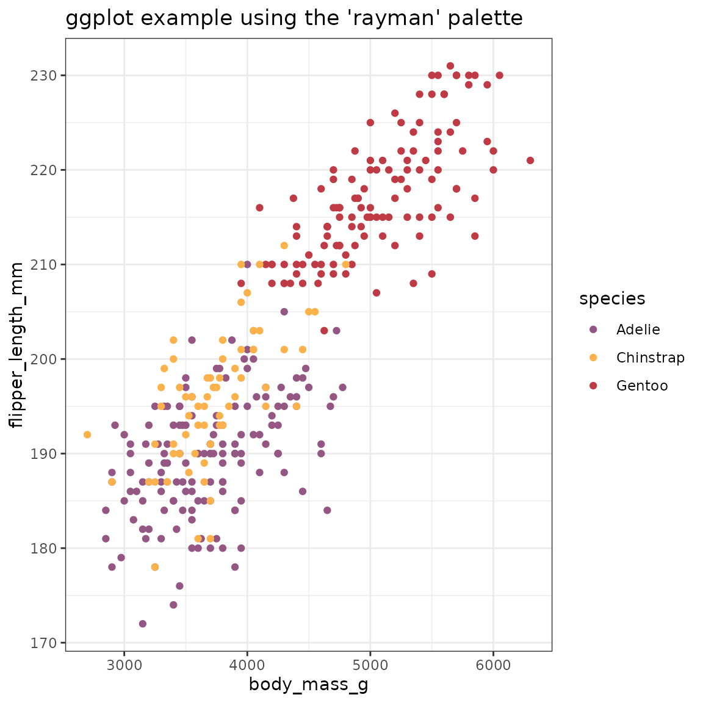
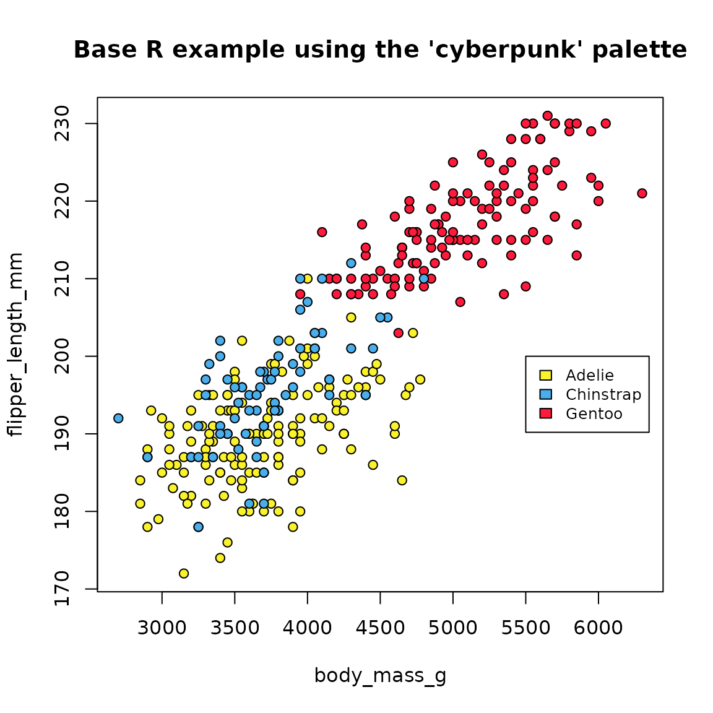

# gameR

``` r
library(gameR)
library(ggplot2)
library(magrittr)
library(palmerpenguins)
data("penguins")
```

Here, we use the `penguins` dataset from the
[palmerpenguins](https://allisonhorst.github.io/palmerpenguins/) package
to provide simple examples of how gameR can be used to customize a plot
using either [ggplot2](https://ggplot2.tidyverse.org) or base R. We will
plot a scatter plot of flipper length (in mm) against body mass (in g)
with the points colored by species.

## Using `{ggplot2}`

To use palettes from gameR in ggplot, a palette can be specified via
either
[`scale_color_manual()`](https://ggplot2.tidyverse.org/reference/scale_manual.html)
or
[`scale_fill_manual()`](https://ggplot2.tidyverse.org/reference/scale_manual.html)
to adjust the color or fill respectively. When specifying a palette, the
`values =` argument must be used. Calling the `scale_*` function will
not allow a palette to be specified if no named argument is used.

``` r
penguins %>%
  ggplot(aes(x = body_mass_g, y = flipper_length_mm, color = species)) +
  geom_point() +
  theme_bw() +
  ggtitle("ggplot example using the 'rayman' palette") +
  scale_color_manual(values = gameR_cols("rayman"))
```



## Using base R

If base R plotting is being used, the `bg` argument can be used to
specify the color of the points. Here we use
[`gameR_cols()`](https://www.constantine-cooke.com/gameR/reference/gameR_cols.md)
in combination with `unclasss()` to color by species.

``` r
par(bg = "white")

attach(penguins)
plot(
  x = body_mass_g,
  y = flipper_length_mm,
  main = "Base R example using the 'cyberpunk' palette",
  cex = 1,
  pch = 21,
  bg = gameR_cols("cyberpunk")[unclass(species)]
)
legend(5500, 200,
  legend = attr(unclass(species), "levels"),
  fill = gameR_cols("cyberpunk"), cex = 0.8
)
```


